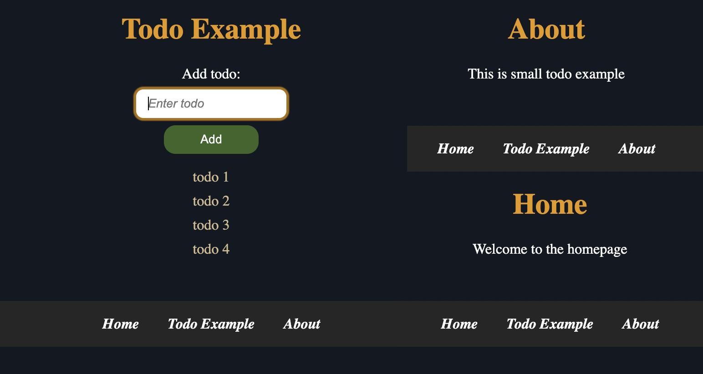

# Testing deployed repository with frontend development

The purpose of deployed repository is to show how repository can be deployed (put online to world wide web) using some of the free hosting clouds. The following example is simple todo application which is frontend and focus is on deploying. It can be extended to more complex CRUD application or used as barebone, but the point is not in app complexity, rather deploying an app.

Backend for the frontend application is in another [repository](https://github.com/pancogit/deploy-backend).

## Free hosting cloud services

There are many free hosting cloud services such as [Render](https://render.com/), [Railway](https://railway.app/), [Netlify](https://www.netlify.com/), [Vercel](https://vercel.com/), etc.

## Example

The following example are using react with typescript and react router. For hosting cloud service is using [Render](https://render.com/) for frontend code. It is frontend application.

## How to run example

There are two ways to run example: locally or online. Local running is used for testing purposes on local machine before putting application online to the web. Online running is used for deploying an app alive to the web.

### Available scripts

There are few scripts written in _package.json_ file for running and debugging app. Please have a look at [react readme file](README_React.md).

### .env configuration files

Copy _.env.format_ file to two files: _.env.development_ (development configuration) and _.env.production_ (production configuration) .

For development configuration use environment variables REACT_APP_SERVER_PORT=4000, REACT_APP_SERVER_ADDRESS=http://localhost . For development mode local nodejs express server is running for serving react application on local machine. [Backend server](https://github.com/pancogit/deploy-backend) is handling react frontend requests.

For production configuration use environment variables REACT_APP_SERVER_ADDRESS=[https://deploy-backend-<CUSTOM_ID>.onrender.com](https://deploy-backend-<CUSTOM_ID>.onrender.com) . For production mode backend api address is used for server application.

### Local app running

To run frontend app, type command:

```shell
npm start
```

It will run frontend app in development mode for debugging purposes.

Backend app is required to handle incoming react frontend requests. To run backend app on Unix like systems (Linux, Mac), type command:

```shell
npm run start-development-unix
```

It will run backend app in development mode for debugging purposes.

There is another command for running local backend app in production mode with hosted mongoDB database:

```shell
npm run start-production-unix
```

To run backend app on windows system use windows npm scripts alternatives in [available scripts](https://github.com/pancogit/deploy-backend/blob/main/README.md#available-scripts) from backend readme file.

Backend server is running on http://localhost:4000/ (see [.env.development](#env-configuration-files) for details).

### Online (deployed) app running

For deployement of app, [Render](https://render.com/) will be used as an example. Login with Github account and dashboard will be opened. Create new static site by _New_ -> _Static Site_ and connect to repository which is needed for deployment. Under _Name_ put some name of static site. Under _Branch_ choose Github branch for app. Under _Build Command_ set _npm run build_ for building static html, css and javascript files for static site when any change is made on Github repository. Finally click on _Create Static Site_ to finish.

When any changes happens on Github repository with new commits, deployment of app will be automatically and server will be restarted and relaunched again. It can take some time.

Now go to _Dashboard_ and click on created static site. Go to _Environment_ and under _Environment Variables_ set all environment variables from [.env.production](#env-configuration-files) file. Those variables will be used as placeholders for all environment variables in the application (_process.env.VARIABLE_NAME_ for react app).

Go to _Redirects/Rewrites_ to set up routing url paths. The example is using react router for client side routing. There are few solutions for this. One solution is to use hash router with hashes in url to handle client side routes, which means that every time page is changed or refreshed, requests will be sent to the homepage because hashes are ignored in url by backend server. For this solution client side code must be changed. Another better solution is to use redirect and rewrite rules to redirect all incoming requests to the homepage. It doesn't matter which page is opened, all requests will be modified to the homepage on the fly. [Render](https://render.com/) by default support redirects. Click _Add Rule_ and in _Source_ set /\* (wildcard for all pages), in _Destination_ set /index.html and for _Action_ choose Rewrite. Now all requests will be rewritten as homepage /index.html.

If app is deployed successfully, then under static site name, click on the link that looks like https://deploy-frontend.onrender.com and deployed frontend app will be opened in new browser tab.


